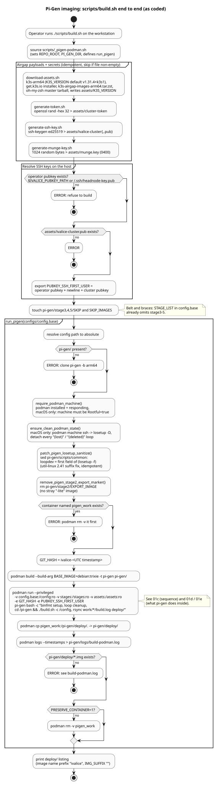
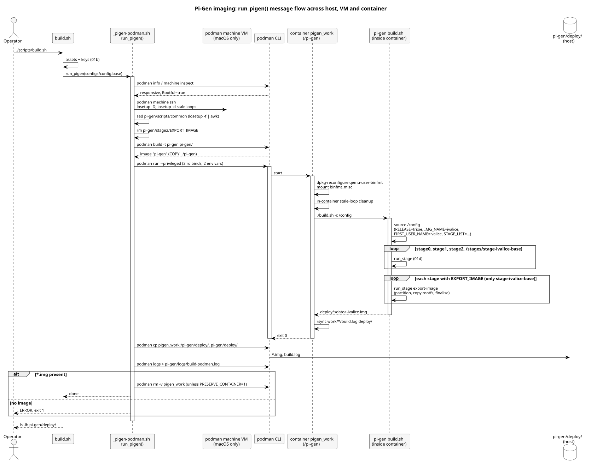
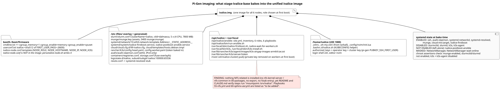

# Build pipeline

The image is built on the operator's workstation (macOS in practice) by
running upstream pi-gen inside a privileged Podman container. pi-gen does
not run on macOS directly, and its stock `build-docker.sh` does not work
with this layout, so the repo carries its own wrapper.

There is a second, independent entry point for CI:
`scripts/ci/build-image.sh` runs pi-gen natively, without Podman, on the
dedicated `pigen-builder` arm64 VM, and `scripts/ci/verify-image.sh` checks
the result. Both are described in
[GitLab CI](../infra/gitlab-ci.md#what-build-image-does) and
[Lab image](../infra/lab-image.md). The two paths share `configs/config.base`,
`stages/` and the pi-gen patch functions in `scripts/_pigen-podman.sh`.

!!! note "pi-gen is pinned to its arm64 branch"
    The `pi-gen` submodule tracks pi-gen's `arm64` branch (`4d8ee44`), which
    exports `ARCH=arm64`. It previously sat on `master` (`d2f70c5`), which
    builds 32-bit armhf images. The `arm64` branch's Dockerfile installs
    `qemu-user` without `qemu-user-binfmt`, so the Podman wrapper now
    reconfigures binfmt only when that package is present (Apple Silicon
    builds natively and does not need it).

{ loading=lazy }

## `scripts/build.sh`

`scripts/build.sh` (44 lines) is the only entry point. In order:

1. Sources `scripts/_pigen-podman.sh` and `cd`s to the repo root.
2. Runs the four asset scripts, all idempotent (they skip files that
   already exist with non-zero size):
   `scripts/download-assets.sh` (k3s `v1.31.4+k3s1` binary, installer,
   airgap image tarball, oh-my-zsh tarball; writes `assets/K3S_VERSION`),
   `scripts/generate-token.sh` (`openssl rand -hex 32`),
   `scripts/generate-ssh-key.sh` (ed25519 cluster key) and
   `scripts/generate-munge-key.sh` (1024 random bytes).
3. Resolves SSH public keys on the host, because the container cannot see
   `~/.ssh`: the operator key from `IVALICE_PUBKEY_PATH` (default
   `~/.ssh/headnode-key.pub`, the build refuses to continue without it)
   and `assets/ivalice-cluster.pub`. It exports both, newline-separated,
   as `PUBKEY_SSH_FIRST_USER`.
4. Touches `SKIP` and `SKIP_IMAGES` in `pi-gen/stage3`, `stage4` and
   `stage5` so the desktop stages are skipped.
5. Calls `run_pigen configs/config.base`.

!!! warning "Drift"
    `CLAUDE.md` and `CONTRIBUTING.md` say `build.sh` runs
    `git submodule update --init --recursive` first and warns when
    `git -C sphinx-asr status --porcelain` is non-empty. Neither step is in
    `scripts/build.sh` today. Initialise submodules by hand.

## `scripts/_pigen-podman.sh`

A sourced helper (330 lines) that replaces pi-gen's `build-docker.sh`.
Its header explains why: `build-docker.sh` misdetects rootful Podman as
rootless and prepends `sudo`, and it bind-mounts only the config file, so
stages and assets that live outside the pi-gen tree are invisible.

`run_pigen <config>` does:

| Step | Function | What it does |
| --- | --- | --- |
| 1 | `require_podman_machine` | Podman installed and responding; on Darwin, the machine must be rootful |
| 2 | `ensure_clean_podman_state` | On Darwin only, detaches stale `(lost)`/`(deleted)` loop devices in the Podman VM over `podman machine ssh` |
| 3 | `patch_pigen_losetup_sanitize` | Edits `pi-gen/scripts/common` so `losetup -f` output is piped through `awk '{print $1}'` (util-linux 2.41 appends `(lost)`), idempotently |
| 4 | `remove_pigen_stage2_export_marker` | Deletes `EXPORT_IMAGE` from pi-gen's `stage2/` so only the ivalice image is exported |
| 5 | container name check | Refuses to start if `pigen_work` (or `CONTAINER_NAME`) already exists |
| 6 | `podman build` | Builds the pi-gen image with `BASE_IMAGE=debian:trixie` |
| 7 | `podman run --privileged` | Bind-mounts `/config`, `/stages`, `/assets` and the whole repo (`/ivalice-repo`, for the sphinx-asr `git archive`) read-only, passes `GIT_HASH` (a UTC timestamp), `IVALICE_REPO_ROOT=/ivalice-repo` and `PUBKEY_SSH_FIRST_USER`, cleans loop devices again inside the container, then runs `./build.sh -c /config` |
| 8 | copy out | `podman cp` of `/pi-gen/deploy/.` to `pi-gen/deploy/`, container log to `pi-gen/logs/build-podman.log`; fails if no `.img` landed |
| 9 | cleanup | Removes the container unless `PRESERVE_CONTAINER=1` |

{ loading=lazy }

!!! warning "Drift"
    Steps 3 and 4 modify the `pi-gen` submodule's working tree without
    recording it (review finding IC-10). The CI path avoids this by
    applying the same two functions to a `git archive` copy of pi-gen
    outside the checkout.

## `configs/config.base`

Read inside the container. Key settings: `RELEASE="trixie"`,
`IMG_NAME="ivalice"`, `FIRST_USER_NAME="ivalice"`, `ENABLE_SSH=1`,
`PUBKEY_ONLY_SSH=0`, `DEPLOY_ZIP=0`, Wi-Fi variables unset, and

```sh
STAGE_LIST="stage0 stage1 stage2 ../stages/stage-ivalice-base"
```

`../stages` resolves to the `/stages` bind mount. `PUBKEY_SSH_FIRST_USER`
uses the `${VAR:?msg}` form so the build aborts if it was not exported by
`scripts/build.sh`. The default `FIRST_USER_PASS` is a published
placeholder (review finding IC-4).

## The custom stage: `stages/stage-ivalice-base/`

| File | Role |
| --- | --- |
| `stages/stage-ivalice-base/prerun.sh` | Standard pi-gen `copy_previous` of the stage2 rootfs |
| `stages/stage-ivalice-base/EXPORT_IMAGE` | Marks this stage for image export (`IMG_SUFFIX=""`) |
| `stages/stage-ivalice-base/00-ivalice-base/00-packages` | apt list: SSH, avahi, systemd-resolved, Podman, build tools, cloud-init, `ansible-core`, `slurmctld`, `slurmd`, `slurm-client`, `munge`, `libpmix2`, zsh, neovim |
| `stages/stage-ivalice-base/00-ivalice-base/01-run.sh` | Copies `files/` into the rootfs, writes `userconf.txt`, validates and installs assets, then configures everything in `on_chroot` |
| `stages/stage-ivalice-base/00-ivalice-base/files/` | Rootfs overlay: systemd units, firstboot scripts, Slurm and cloud-init config, the Ansible tree under `/opt/ivalice/ansible`, home directory dotfiles |
| `stages/stage-ivalice-base/10-sphinx-asr/00-run.sh` | Host side: fails unless the `sphinx-asr` submodule is checked out, clean and at its pinned commit; `git archive`s it into `/srv/ivalice/sphinx-asr`; deletes the committed x86 objects; lends the chroot the host resolver |
| `stages/stage-ivalice-base/10-sphinx-asr/01-run-chroot.sh` | In the chroot: `make clean && make` into `bin/aarch64/`, `.venv` from `requirements.txt`, `/usr/local/bin/sphinx`, toolchain and `pip freeze` into `IMAGE-MANIFEST.txt` |
| `stages/stage-ivalice-base/10-sphinx-asr/02-run.sh` | Host side: `file` output for `bin/aarch64/*`, restores `/etc/resolv.conf`, installs `/etc/profile.d/sphinx-asr.sh` (also sourced from the zsh zprofile), `chown -R -h 1000:1000 /srv/ivalice` |

The sphinx-asr sub-stage is described in detail on the
[Lab image](../infra/lab-image.md#the-sphinx-asr-payload) page.

`01-run.sh`, outside the chroot, refuses to continue unless every asset is
present (`k3s`, `k3s-install.sh`, `k3s-airgap-images-arm64.tar.zst`,
`cluster-token`, `ivalice-cluster`, `ivalice-cluster.pub`, `munge.key`,
`ohmyzsh.tar.gz`), installs them, and writes
`/etc/rancher/k3s/config.worker.yaml` with the baked token. Inside the
chroot it:

- enables ssh, avahi, systemd-networkd, systemd-resolved,
  `ivalice-firstboot.service`, `cloud-init.target` and munge;
- creates Slurm spool and log directories and leaves both `slurmctld` and
  `slurmd` disabled (firstboot picks one);
- disables and masks NetworkManager, which stage2 enables;
- sets zsh for `ivalice`, adds subuid/subgid ranges for rootless Podman,
  and adds the memory/cpuset cgroup flags to `cmdline.txt`;
- runs `k3s-install.sh` twice (server, then agent) with downloads, start
  and enable all skipped, so both units exist but are disabled;
- asserts the result: munge enabled, Slurm and k3s units disabled.

{ loading=lazy }

!!! warning "Drift"
    `assets/README.md` says `assets/K3S_VERSION` "is consumed by"
    `stages/stage-ivalice-base/00-ivalice-base/01-run.sh`. It is not: the
    script never reads it; the file is a record only.

## Related diagrams

- [Code-verified 01 Pi-gen imaging](../uml-verified/01-pigen-imaging/index.md)
  (01a to 01f cover the build).
- [Phase 0 01 Build lifecycle](../uml/01-build-lifecycle/index.md), which
  also contrasts the unused stock Docker path.
