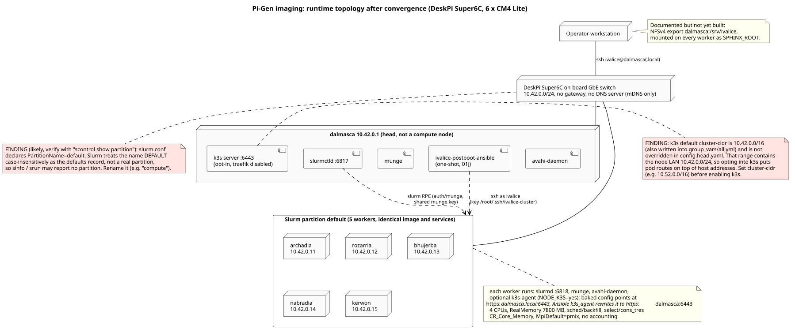

# Architecture

One image, six nodes. Every node is flashed with the same `ivalice.img`;
a small per-node file on the boot partition decides whether the node
becomes the head or a worker on first boot. The head then converges the
whole cluster with Ansible.

## Topology

Source of truth: `scripts/personalize-node.sh` (`HOST_IPS`), mirrored in
`stages/stage-ivalice-base/00-ivalice-base/files/etc/slurm/slurm.conf`,
`stages/stage-ivalice-base/00-ivalice-base/files/opt/ivalice/ansible/inventory/hosts.yml`
and `stages/stage-ivalice-base/00-ivalice-base/files/etc/cloud/templates/hosts.debian.tmpl`.
These four must change together.

| Role | Hostname | IP | Services enabled by firstboot |
| --- | --- | --- | --- |
| Head | dalmasca | 10.42.0.1/24 | munge, slurmctld (port 6817), ivalice-postboot-ansible; k3s server if `NODE_K3S=yes` |
| Worker | archadia | 10.42.0.11/24 | munge, slurmd (port 6818); k3s agent if `NODE_K3S=yes` |
| Worker | rozarria | 10.42.0.12/24 | as above |
| Worker | bhujerba | 10.42.0.13/24 | as above |
| Worker | nabradia | 10.42.0.14/24 | as above |
| Worker | kerwon | 10.42.0.15/24 | as above |

Hardware: DeskPi Super6c, six CM4 Lite modules, 4 cores and 8 GB each
(`slurm.conf` declares `CPUs=4 RealMemory=7800`). Single user `ivalice`
(UID 1000) with zsh. No gateway and no DNS server: `/etc/hosts` is
rendered by cloud-init from the template above, and avahi provides
`.local` names.

{ loading=lazy }

## Components

| Component | Where it lives | Page |
| --- | --- | --- |
| Image build (macOS host, rootful Podman VM, privileged pi-gen container) | `scripts/build.sh`, `scripts/_pigen-podman.sh`, `configs/config.base` | [Build pipeline](build-pipeline.md) |
| Custom pi-gen stage (packages, rootfs overlay, k3s/munge/Slurm layout) | `stages/stage-ivalice-base/` | [Build pipeline](build-pipeline.md) |
| Airgap payloads (k3s, oh-my-zsh, keys, token) | `assets/` (gitignored, see `assets/README.md`) | [Build pipeline](build-pipeline.md) |
| Per-node identity | `scripts/personalize-node.sh` writes `ivalice-node.conf` on the boot partition | [Provisioning](provisioning.md) |
| First boot role dispatch | `ivalice-firstboot.service` and `ivalice-firstboot.sh` | [Provisioning](provisioning.md) |
| Postboot convergence (head only) | `ivalice-postboot-ansible.service`, `site.yml` and six roles | [Provisioning](provisioning.md) |
| ASR workload | `sphinx-asr/` submodule | [Workload](workload.md) |

## Phase status

| Phase | Scope | State in the code today |
| --- | --- | --- |
| 0 | UML design baseline | Done: `docs/uml/` (Phase 0) and `docs/uml-verified/` (code-verified) |
| 1 | Provisioning: NFS, packages, Ansible | Partial: Ansible for Slurm and k3s exists; no NFS, no sphinx-asr stage or playbook |
| 2 | Image bake | Works on Apple Silicon through Podman |
| 3 | Slurm and sphinx-asr integration | Not started: sphinx-asr still uses `Queue::POSIX` with one part |

!!! warning "Drift"
    `CLAUDE.md` (owner-maintained, not in git) and `README.md` describe
    pieces that are not in the tree yet: an NFSv4 export of `/srv/ivalice`,
    a `stages/stage-ivalice-base/10-sphinx-asr/` sub-stage, playbooks
    `55-nfs.yml` and `60-sphinx-asr.yml`, `scripts/stage-corpus.sh`,
    `scripts/smoke-sphinx.sh`, `assets/sphinx-wheels/` and
    `docs/daily-logs/`. `README.md` also lists "nfs" among the packages in
    `stages/stage-ivalice-base/00-ivalice-base/00-packages`, which has no
    NFS package. Treat them as planned (they are listed in
    `docs/.planned-paths`), not as built.

!!! warning "Drift: pi-gen branch"
    `configs/config.base` assumes pi-gen's `arm64` branch ("Build a Debian
    13 Trixie arm64 image (assumes pi-gen is on the 'arm64' branch)"), but
    `git submodule status` describes the pinned commit `d2f70c5` as
    `2026-04-13-raspios-trixie-armhf-2`. The code-verified UML set lists
    this as its top finding. Check the submodule branch before trusting an
    arm64 build.

## Diagrams

- Code-verified: [01 Pi-gen imaging](../uml-verified/01-pigen-imaging/index.md)
  covers build, image contents, flashing, first boot and convergence.
- Phase 0: [01 Build lifecycle](../uml/01-build-lifecycle/index.md),
  [04 Slurm integration](../uml/04-slurm-integration/index.md),
  [05 Federation](../uml/05-federation-future/index.md).
