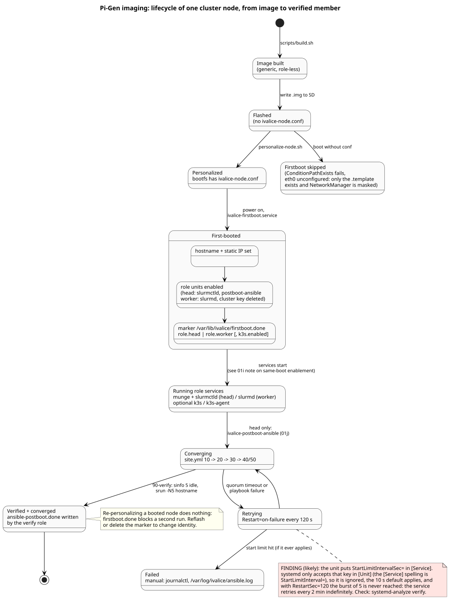
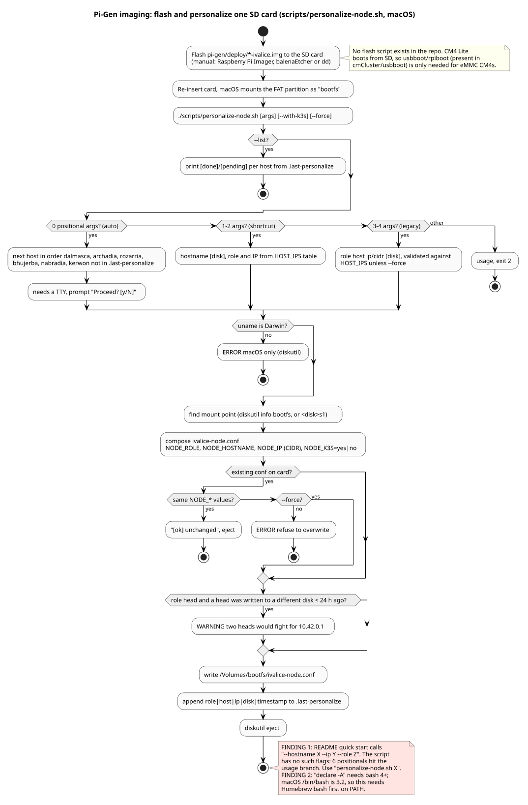
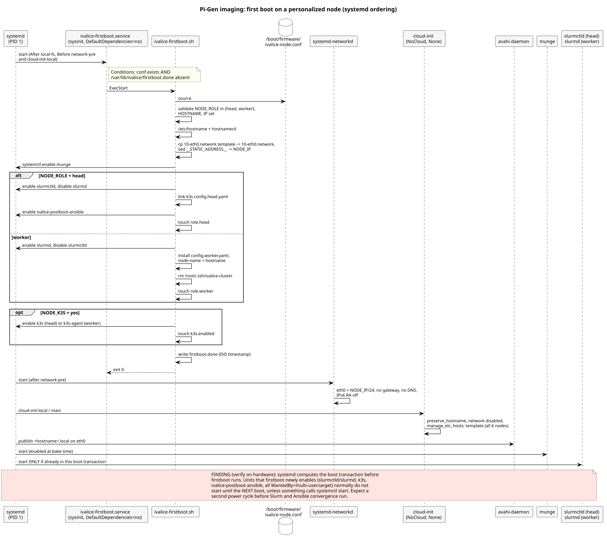
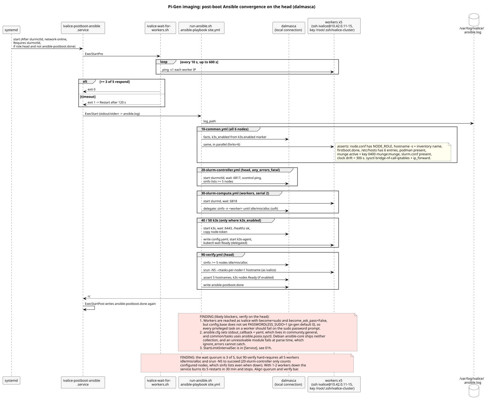

# Provisioning

After the image is flashed, a node goes through three steps: the operator
personalizes the card, the node runs firstboot, and (on the head only) a
postboot service converges the whole cluster with Ansible.

{ loading=lazy }

## 1. Personalize: `scripts/personalize-node.sh`

Runs on macOS only (it uses `diskutil`) and writes
`/boot/firmware/ivalice-node.conf` onto the mounted `bootfs` volume of a
freshly flashed card:

```sh
NODE_ROLE=worker          # head | worker
NODE_HOSTNAME=archadia
NODE_IP=10.42.0.11/24     # CIDR form
NODE_K3S=no               # yes opts the node into k3s
```

Invocation modes (from the script header):

| Command | Behaviour |
| --- | --- |
| `personalize-node.sh` | Auto: picks the next node not yet in `.last-personalize`, asks for confirmation (needs a TTY) |
| `personalize-node.sh <hostname> [disk]` | Infers role and IP from `HOST_IPS` |
| `personalize-node.sh <role> <host> <ip/cidr> [disk]` | Legacy explicit form; validated against `HOST_IPS` unless `--force` |
| `personalize-node.sh --list` | Prints done/pending per node from `.last-personalize` |

Flags: `--with-k3s` (sets `NODE_K3S=yes`), `--force`, `-h`. The script
compares only the `NODE_*` lines with an existing file (the timestamp
comment is ignored), refuses to overwrite a differing file without
`--force`, warns if a head was personalized on another disk in the last
24 hours, appends a line to `.last-personalize`, and ejects the card.

{ loading=lazy }

!!! warning "Drift"
    The quick start in `README.md` (and `CLAUDE.md`) calls
    `personalize-node.sh --hostname dalmasca --ip 10.42.0.1 --role head`.
    The script has no such flags: unknown arguments become positionals,
    six of them hit the `*)` branch, and the script prints usage and exits
    2. Use `./scripts/personalize-node.sh dalmasca`. The script also uses
    `declare -A`, which needs bash 4 or newer; stock macOS bash is 3.2.

## 2. First boot: `ivalice-firstboot.service`

Unit: `stages/stage-ivalice-base/00-ivalice-base/files/etc/systemd/system/ivalice-firstboot.service`.
It runs early (`DefaultDependencies=no`, `Before=network-pre.target
cloud-init-local.service`) and only if
`/boot/firmware/ivalice-node.conf` exists and
`/var/lib/ivalice/firstboot.done` does not.

Script: `stages/stage-ivalice-base/00-ivalice-base/files/usr/local/sbin/ivalice-firstboot.sh`.

1. Sources the node conf and requires `NODE_ROLE`, `NODE_HOSTNAME`,
   `NODE_IP`; the role must be `head` or `worker`.
2. Writes `/etc/hostname` and calls `hostnamectl`.
3. Copies `10-eth0.network.template` and substitutes
   `__STATIC_ADDRESS__` with `NODE_IP` (no gateway, no DNS).
4. Enables munge, then dispatches on role:

    | | Head | Worker |
    | --- | --- | --- |
    | Slurm | enable `slurmctld`, disable `slurmd` | enable `slurmd`, disable `slurmctld` |
    | k3s config | symlink `config.head.yaml` to `config.yaml` | copy `config.worker.yaml`, set `node-name` |
    | Postboot | enable `ivalice-postboot-ansible.service` | (none) |
    | SSH key | keeps `/root/.ssh/ivalice-cluster` | deletes it |
    | Marker | `/var/lib/ivalice/role.head` | `/var/lib/ivalice/role.worker` |

5. If `NODE_K3S` is `yes`, `true` or `1`, enables `k3s.service` (head) or
   `k3s-agent.service` (worker) and touches `/var/lib/ivalice/k3s.enabled`.
6. Writes the timestamp to `/var/lib/ivalice/firstboot.done`.

cloud-init (`99-ivalice.cfg`) runs afterwards with networking disabled,
`preserve_hostname: true` and `manage_etc_hosts: template`, so it only
renders `/etc/hosts` from `hosts.debian.tmpl`.

{ loading=lazy }

!!! note "Open finding"
    Units enabled with `systemctl enable` this early are not added to the
    current boot transaction, so the node probably needs one more reboot
    before Slurm and the postboot service start (review finding IC-3).

## 3. Postboot convergence (head only)

Unit: `stages/stage-ivalice-base/00-ivalice-base/files/etc/systemd/system/ivalice-postboot-ansible.service`.
Conditions: `/var/lib/ivalice/role.head` exists and
`/var/lib/ivalice/ansible-postboot.done` does not. It requires
`slurmctld.service` and orders after `network-online.target`.

| Phase | Command | Detail |
| --- | --- | --- |
| `ExecStartPre` | `ivalice-wait-for-workers.sh` | Pings the five worker IPs every 10 s; succeeds once 3 answer in one pass; gives up after 600 s |
| `ExecStart` | `/opt/ivalice/bin/run-ansible.sh` | `ansible-playbook -i inventory/hosts.yml site.yml` |
| `ExecStartPost` | `date > /var/lib/ivalice/ansible-postboot.done` | Marker so the unit does not run again |
| On failure | `Restart=on-failure`, `RestartSec=120` | Output appended to `/var/log/ivalice/ansible.log` |

`site.yml` imports the playbooks in this order
(`stages/stage-ivalice-base/00-ivalice-base/files/opt/ivalice/ansible/site.yml`):

| Order | Playbook | Hosts | Role | What it checks or does |
| --- | --- | --- | --- | --- |
| 10 | `10-common.yml` | cluster | `common` | Sets `k3s_enabled` from the marker; asserts node conf, hostname, firstboot marker, `/etc/hosts` entries, munge key mode and owner, `slurm.conf`, clock drift under 300 s; sysctls for k3s; munge running |
| 20 | `20-slurm-controller.yml` | head | `slurm_controller` | slurmctld running, port 6817, `scontrol ping`, `sinfo` lists at least 5 nodes (fatal on error) |
| 30 | `30-slurm-compute.yml` | workers, 2 at a time | `slurm_compute` | slurmd running, port 6818, soft wait for `idle`/`mix`/`alloc` in `sinfo` |
| 40 | `40-k3s-server.yml` | head | `k3s_server` (when `k3s_enabled`) | k3s running, port 6443, `/healthz`, exports the node token |
| 50 | `50-k3s-agent.yml` | workers, 2 at a time | `k3s_agent` (when `k3s_enabled`) | Renders agent config, starts `k3s-agent`, waits for node Ready |
| 90 | `90-verify.yml` | head | `verify` | `sinfo` shows 5 healthy workers, `srun -N5 hostname` returns all five, k3s nodes Ready if enabled, writes the postboot marker |

{ loading=lazy }

!!! warning "Drift"
    `CLAUDE.md` lists `55-nfs.yml` and `60-sphinx-asr.yml` between 50 and
    90 ("to be added in Phase 1"). Neither exists, there is no NFS package
    or export, so `/srv/ivalice` is not shared yet.

!!! note "Open findings that affect this flow"
    The quorum is 3 workers but `verify` requires all 5 (IC-6);
    `StartLimitBurst` and `StartLimitIntervalSec` sit in `[Service]`
    where systemd ignores them (IC-7); `ansible.posix.sysctl` and the
    `yaml` stdout callback need collections that Debian's `ansible-core`
    does not ship (IC-2). See the [baseline review](../reviews/2026-10-04-baseline.md).

## Related diagrams

- [Code-verified 01 Pi-gen imaging](../uml-verified/01-pigen-imaging/index.md),
  diagrams 01g to 01k.
- [Phase 0 04 Slurm integration](../uml/04-slurm-integration/index.md)
  for the planned post-integration deployment.
