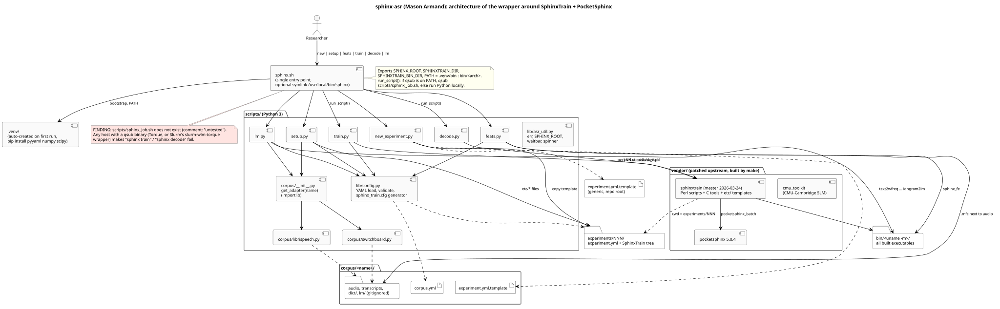
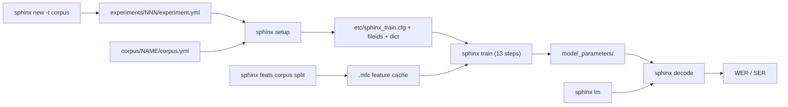
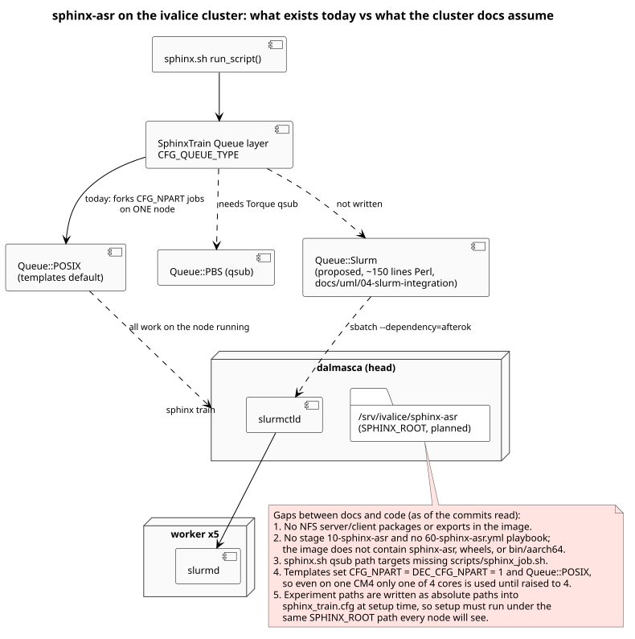

# Workload: sphinx-asr

`sphinx-asr/` is a git submodule (`git@github.com:masonarmand/sphinx-asr.git`,
pinned at `1aa0441`). It wraps CMU SphinxTrain, PocketSphinx and the CMU
SLM toolkit with a shell entry point and a set of Python scripts, and it
is the workload the cluster exists to run. Changes to it land in its own
repository; this repository only bumps the pointer (see
`CONTRIBUTING.md`).

{ loading=lazy }

## Entry point and commands

`sphinx-asr/sphinx.sh` creates `.venv` on first use (installing
`requirements.txt`), exports `SPHINX_ROOT`, `SPHINXTRAIN_DIR` and
`SPHINXTRAIN_BIN_DIR`, puts `bin/$(uname -m)` on `PATH`, and dispatches:

| Command | Script | What it does |
| --- | --- | --- |
| `new [-t CORPUS] [-l]` | `sphinx-asr/scripts/new_experiment.py` | Copies a template to the next free `experiments/NNN/experiment.yml` |
| `setup <exp_dir>` | `sphinx-asr/scripts/setup.py` | Resolves corpora, writes fileids, transcriptions, dictionary, phone and filler lists, `feat.params` and `etc/sphinx_train.cfg` |
| `feats <corpus> <split>` | `sphinx-asr/scripts/feats.py` | Runs `sphinx_fe` per utterance in a thread pool and caches `.mfc` files |
| `lm <corpus> <split>` or `--all` | `sphinx-asr/scripts/lm.py` | Builds an ARPA trigram LM with the CMU SLM toolkit |
| `train <exp_dir>` | `sphinx-asr/scripts/train.py` | Runs 13 SphinxTrain Perl steps (`00.verify` to `90`), validating artifacts and logs, `--from-step` to resume |
| `decode <exp_dir>` | `sphinx-asr/scripts/decode.py` | Runs SphinxTrain `decode/slave.pl` with a progress thread and reports WER |

Shared code lives in `sphinx-asr/scripts/lib/config.py` (YAML loading,
validation, `sphinx_train.cfg` generation) and
`sphinx-asr/scripts/lib/asr_util.py`. Corpus formats are adapters in
`sphinx-asr/scripts/corpus/` (`librispeech`, `switchboard`), loaded by
name through `corpus.get_adapter`.

Every function and module is documented in the generated
[API reference](../api/index.md). The keys an experiment can set are in
the generated [settings reference](../experiments/settings.md), and how
those settings changed over time is in the
[settings changelog](../experiments/changelog.md).

## Experiment flow

Configuration precedence when `setup` writes `sphinx_train.cfg`
(`sphinx-asr/scripts/lib/config.py`, `generate_sphinx_train_cfg`): the
vendor template, then path placeholders, then values from the **first**
training corpus (`audio_format`, `sample_rate`, filterbank, `cmn`), then
fixed defaults, the LM and decode paths, and finally the experiment's
`sphinxtrain:` block.

## Running it on the cluster

Today the workload is not wired into the cluster:

- The image has no copy of `sphinx-asr` and no wheels: the planned
  `stages/stage-ivalice-base/10-sphinx-asr/` sub-stage and
  `assets/sphinx-wheels/` do not exist yet.
- There is no shared filesystem. The design puts `SPHINX_ROOT` at
  `/srv/ivalice/sphinx-asr` on an NFSv4 export from the head, but no NFS
  package, export or mount exists.
- Every template sets `CFG_QUEUE_TYPE: "Queue::POSIX"`, `CFG_NPART: 1` and
  `DEC_CFG_NPART: 1`, so a run uses one core on one machine. The planned
  `Queue::Slurm` adapter and `sbatch --array` decode exist only in the
  Phase 0 design ([04 Slurm integration](../uml/04-slurm-integration/index.md)).
- `sphinx.sh` submits `train` and `decode` with `qsub` when that command
  exists, pointing it at a `sphinx_job.sh` in the submodule's scripts
  directory, which is missing (review finding SA-19). A Slurm install may provide a `qsub`
  wrapper, so this branch can trigger on the cluster.

{ loading=lazy }

!!! warning "Drift"
    The sphinx-asr `CLAUDE.md` (review finding SA-20) describes a
    `Queue/Slurm.pm` adapter, `sphinx status` and `sphinx cancel` commands
    and an `sbatch --array` decode path. None of these exist in the
    submodule at `1aa0441`; they are Phase 3 design only.

## Validity caveats for thesis results

The baseline review found issues that change what a WER number means.
Read [the review](../reviews/2026-10-04-baseline.md) before quoting results;
the main ones are that decode utterances with out-of-vocabulary words are
dropped (SA-4), a crashed training step can count as success (SA-1), and
front-end overrides in `sphinxtrain:` do not reach the cached features
(SA-7).
