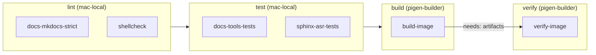

# GitLab CI

The pipeline in `.gitlab-ci.yml` lints and tests every change on a shared
runner and builds and verifies the cluster image on a dedicated arm64 VM.
The operator's manual build (`scripts/build.sh`, Podman on macOS, see
[Build pipeline](../architecture/build-pipeline.md)) is unchanged and
independent of CI.

!!! danger "CI artifacts are secret"
    Every CI image contains freshly generated, build-specific secrets (the
    munge key, the k3s cluster token and the cluster SSH private key under
    `/root/.ssh/`) and the published default password from
    `configs/config.base` with `PUBKEY_ONLY_SSH=0` and passwordless sudo
    (review finding IC-4, still open). Anyone holding the `.img.xz` can
    log in to a node flashed from it. Treat the image store on the
    runner (`/var/lib/ivalice-images/`) as secret: keep the project
    private, do not attach images to releases or packages, and do not copy
    them off the operator's machines. Only the five newest builds are kept.

## Runner topology

| Runner | Kind | Where | Executor | Tags | Used for |
| --- | --- | --- | --- | --- | --- |
| `mac-local` | instance (shared) | Lima VM `gitlab-runner-lima`, rootless Podman, 2 GB, 1.5 CPU | docker, unprivileged (default image `debian:12-slim`) | `mac-local` | lint and test jobs |
| `pigen-builder` | project (locked to `unh/pi-cluster`) | Lima VM `pigen-builder`, Debian 13 arm64, vz, 8 CPU, 16 GB, 120 GB | shell, as `gitlab-runner` with passwordless sudo, `concurrent = 1` | `pigen`, `aarch64` (`run_untagged = false`) | `build-image`, `verify-image` |

Why two runners:

- pi-gen needs root, loop devices and bind mounts into chroots. Granting
  that on the shared runner would give every project root on its VM, and
  2 GB is too small for the build.
- `pigen-builder` is native arm64 under Virtualization.framework, so pi-gen
  arm64 and the sphinx-asr vendor build run without qemu. The vendor
  `make` takes seconds there instead of about 30 minutes on a CM4.
- It is a shell executor because pi-gen drives the kernel directly (loop
  devices, `mount`, `chroot`); a container would have to be privileged
  anyway.

The decision and the alternatives are in
[ADR 0002](../standards/adr/0002-dedicated-lima-runner-for-image-builds.md).

## Creating the `pigen-builder` VM

From the repo root on the Mac:

```sh
limactl create --name pigen-builder infra/lima/pigen-builder.yaml
limactl start pigen-builder
```

The template (`infra/lima/pigen-builder.yaml`) starts from Lima's Debian 13
image, shares no host directories, installs pi-gen's host dependencies plus
`build-essential`, `bison`, `swig`, `python3-venv`, `jq` and `shellcheck`,
and maps `git.bytehearth.internal` to `192.168.5.2` (the host as seen from
a Lima guest), where the GitLab VM's port 8443 is forwarded.

## Registering the runner

```sh
infra/lima/register-runner.sh
```

The script needs `glab` authenticated against the GitLab instance. It:

1. Copies the mkcert root CA (`$MKCERT_CA`, default
   `~/.local/share/mkcert/rootCA.pem`) into the VM's trust store.
2. Installs `gitlab-runner` (`RUNNER_VERSION`, default `v19.3.0`) from the
   official arm64 packages.
3. Gives `gitlab-runner` passwordless sudo in that VM only.
4. Creates a locked project runner for `unh/pi-cluster` through the API
   (tags `pigen,aarch64`, untagged jobs off, 3 h maximum timeout), passes
   the token to `gitlab-runner register` on stdin, and sets
   `concurrent = 1`.

Re-running it is safe: a VM that already has a `[[runners]]` entry is left
alone. Overrides: `GITLAB_HOST`, `GITLAB_PROJECT`, `LIMA_VM`,
`RUNNER_VERSION`, `MKCERT_CA`.

## Pipeline



| Stage | Job | Runner | What it runs |
| --- | --- | --- | --- |
| lint | `docs-mkdocs-strict` | `mac-local`, `python:3.12-slim` | `uv run --group docs mkdocs build --strict` (needs the `sphinx-asr` submodule and full history) |
| lint | `shellcheck` | `mac-local`, `debian:12-slim` | `shellcheck` on every `*.sh` under `scripts/` and `stages/` |
| test | `docs-tools-tests` | `mac-local`, `python:3.12-slim` | `uv run --group docs --with pytest pytest tools/docs/tests -q` |
| test | `sphinx-asr-tests` | `mac-local`, `python:3.12-slim` | sphinx-asr's own pytest suite from the submodule, with `requirements.txt` |
| build | `build-image` | `pigen-builder` | `scripts/ci/build-image.sh` |
| verify | `verify-image` | `pigen-builder` | `scripts/ci/verify-image.sh` on the built image; JUnit report |

Rules:

- **Workflow.** A pipeline runs for merge requests, schedules, manual
  ("Run pipeline") starts, tags and branches. A branch push with an open
  merge request runs only the merge request pipeline, so nothing runs
  twice.
- **`build-image`** starts automatically on `main`, on tags and on
  schedules. Everywhere else (merge requests, feature branches) it is a
  manual job with `allow_failure: true`, so the pipeline still passes when
  nobody builds an image. It has a 3 h timeout and
  `resource_group: pigen`, so two image builds never overlap (the runner
  also runs one job at a time).
- **`verify-image`** needs `build-image` and its artifacts, and runs as
  soon as the build succeeds.
- **Submodules.** Both point at public GitHub HTTPS URLs, so the runners
  fetch them anonymously; `GIT_SUBMODULE_FORCE_HTTPS` (which only rewrites
  SSH or relative URLs on this GitLab) is not needed. The lint and test
  jobs fetch only `sphinx-asr` (`GIT_SUBMODULE_PATHS`); `build-image`
  fetches both with full history so `git describe` can name the pi-gen
  version.

## What `build-image` does

`scripts/ci/build-image.sh` (its header documents every variable and exit
code):

1. Checks the host (Linux, aarch64, passwordless sudo, tools) and that the
   pinned pi-gen builds `ARCH=arm64`.
2. Runs `git submodule update --init --recursive` and fails (exit 3) when a
   submodule is uninitialised, off its pinned commit, or dirty.
3. Deletes any secrets in `assets/`, generates new ones with
   `scripts/generate-token.sh`, `scripts/generate-ssh-key.sh` and
   `scripts/generate-munge-key.sh`, and runs `scripts/download-assets.sh`.
   The secrets are deleted again when the script exits.
4. Builds `PUBKEY_SSH_FIRST_USER` like `scripts/build.sh`: the operator key,
   a newline, then the cluster key.
5. Exports pi-gen with `git archive` into `/var/tmp/ivalice-ci/<job id>`,
   symlinks `stages/` next to it, and applies the same adjustments as the
   Podman path (SKIP markers on stage3 to stage5, no stage2 export, the
   `losetup -f` patch, reusing the functions in `scripts/_pigen-podman.sh`).
   The submodule checkout is never modified and no root-owned file lands
   in the build directory.
6. Runs pi-gen's `build.sh -c configs/config.base` as root with
   `IVALICE_REPO_ROOT` set, so the sphinx-asr sub-stage can `git archive`
   the pinned commit.
7. Compresses the image with xz, writes the outputs below, and removes the
   work tree (after unmounting and detaching anything a killed build left
   behind).

### Operator SSH key

Set a CI/CD variable so nodes accept the operator's key:

- `IVALICE_PUBKEY_PATH` as a **File** variable holding the public key, or
- `IVALICE_OPERATOR_PUBKEY` as a plain variable with the key text.

Without either, the build warns and the image trusts only its ephemeral
cluster key. Set `IVALICE_REQUIRE_OPERATOR_KEY=1` to make that an error.

## Artifacts

The compressed image (about 1.1 GiB) is larger than the instance's
`max_artifacts_size` (1024 MB), so it never goes through GitLab.
`scripts/ci/store-image.sh` moves it to
`/var/lib/ivalice-images/<pipeline id>/` on the `pigen-builder` VM, keeps
the five newest builds (`IVALICE_IMAGE_KEEP`), and writes the path to
`out/IMAGE_PATH`; `verify-image` runs on the same runner and reads it from
there. To flash a CI image, copy it off the VM:

```sh
limactl copy pigen-builder:/var/lib/ivalice-images/<pipeline id>/<date>-ivalice.img.xz .
```

`build-image` uploads the rest of `out/` (kept one week; the manifest is
linked from merge requests through `artifacts:expose_as`):

| File | Content |
| --- | --- |
| `out/IMAGE_PATH` | where the image sits on the runner |
| `out/image-manifest.json` | repo sha and branch, pi-gen and sphinx-asr submodule shas, pi-gen version (`git describe`) and arch, k3s version, sha256 of `configs/config.base` and every file in `assets/`, sha256 and size of the raw image and of the `.xz`, pipeline and job ids |
| `out/sphinx-asr-IMAGE-MANIFEST.txt` | the manifest baked into the image (see [Lab image](lab-image.md)) |
| `out/build.log`, `out/*.info` | pi-gen's build log and package list |
| `out/SHA256SUMS` | `sha256sum` of every file above |

`verify-image` uploads `out/verify/` (TAP stream and JUnit XML) and
publishes the JUnit file as a test report, so failed checks show up in the
pipeline's Tests tab and in merge requests.

!!! note "Why the image is not an artifact"
    The first build (pipeline 130) produced a 1072 MiB `.img.xz` and its
    upload failed with HTTP 413. Raising `max_artifacts_size` would also
    work, but keeping the image on the runner avoids pushing a gigabyte
    through GitLab on every build, and keeps the secrets-bearing image on
    one machine.

## Running a build by hand

From GitLab: open the pipeline for the branch (or start one with **Build >
Pipelines > Run pipeline**) and press play on `build-image`. With `glab`:

```sh
glab ci run -b <branch>      # then play build-image in the pipeline view
glab ci view -b <branch>
```

Directly on the VM, without GitLab, use a scratch clone (the script
replaces and deletes the secrets in `assets/`):

```sh
limactl shell pigen-builder
git clone --recurse-submodules https://git.bytehearth.internal:8443/unh/pi-cluster.git /var/tmp/pi-cluster
cd /var/tmp/pi-cluster
IVALICE_PUBKEY_PATH=/path/to/key.pub scripts/ci/build-image.sh
scripts/ci/verify-image.sh --manifest out/image-manifest.json out/*.img.xz
```

`IVALICE_KEEP_WORK=1` keeps `/var/tmp/ivalice-ci/<id>` for triage. If a
build was killed hard, check `findmnt | grep ivalice-ci` and
`losetup -l` before deleting that directory.
